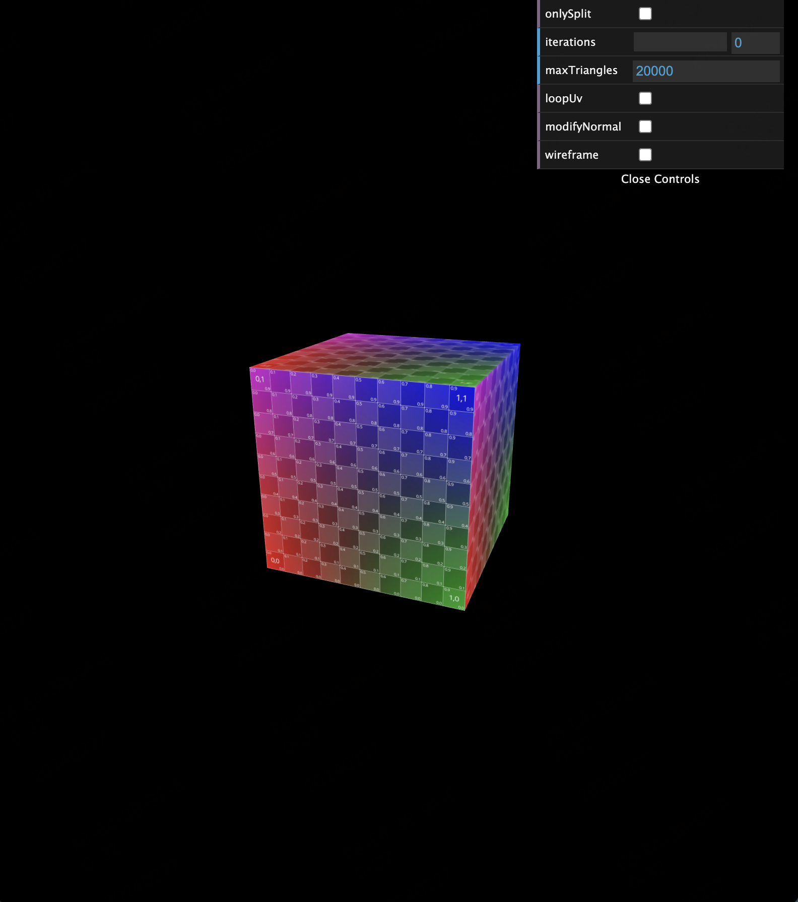
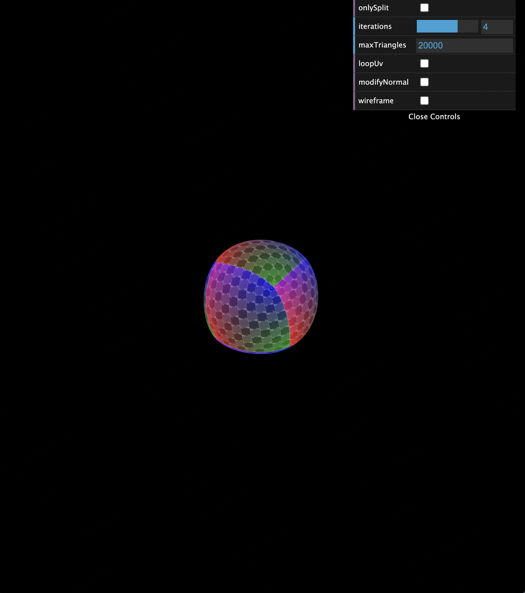
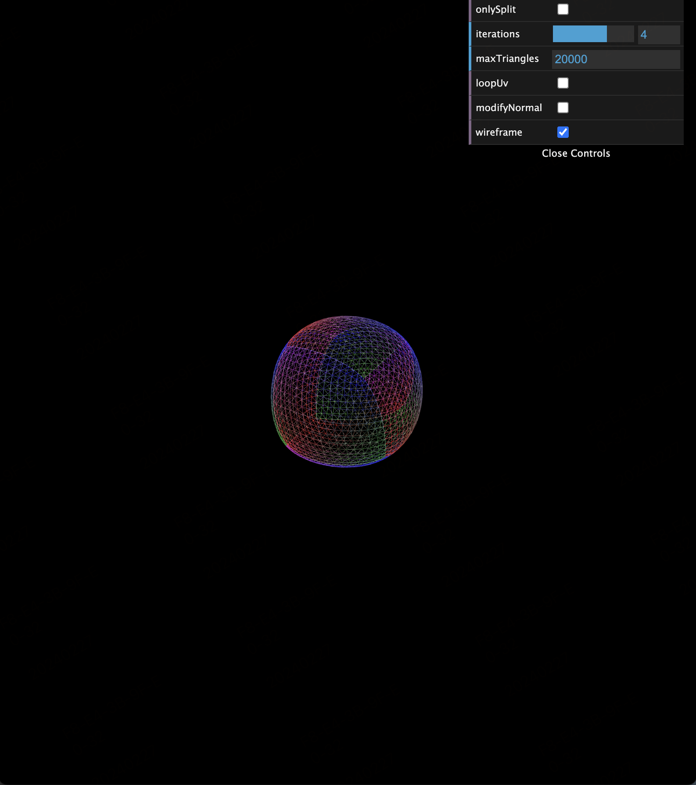
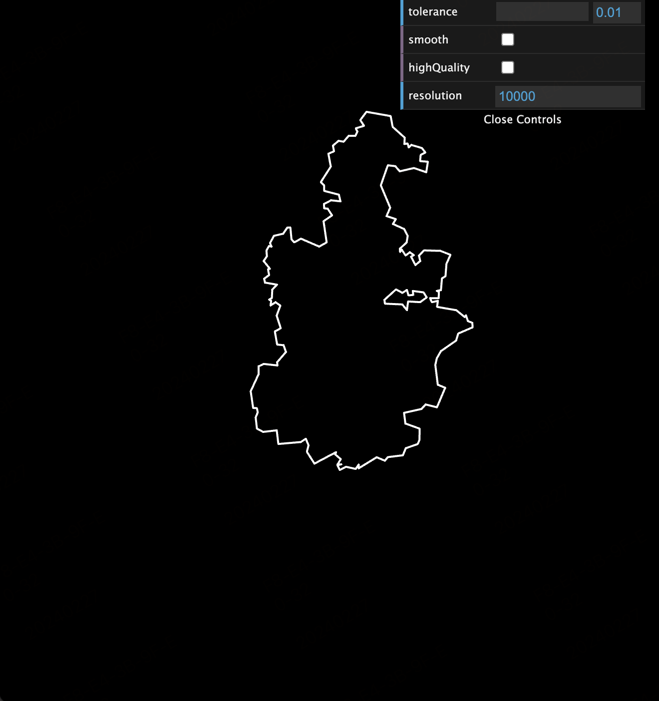
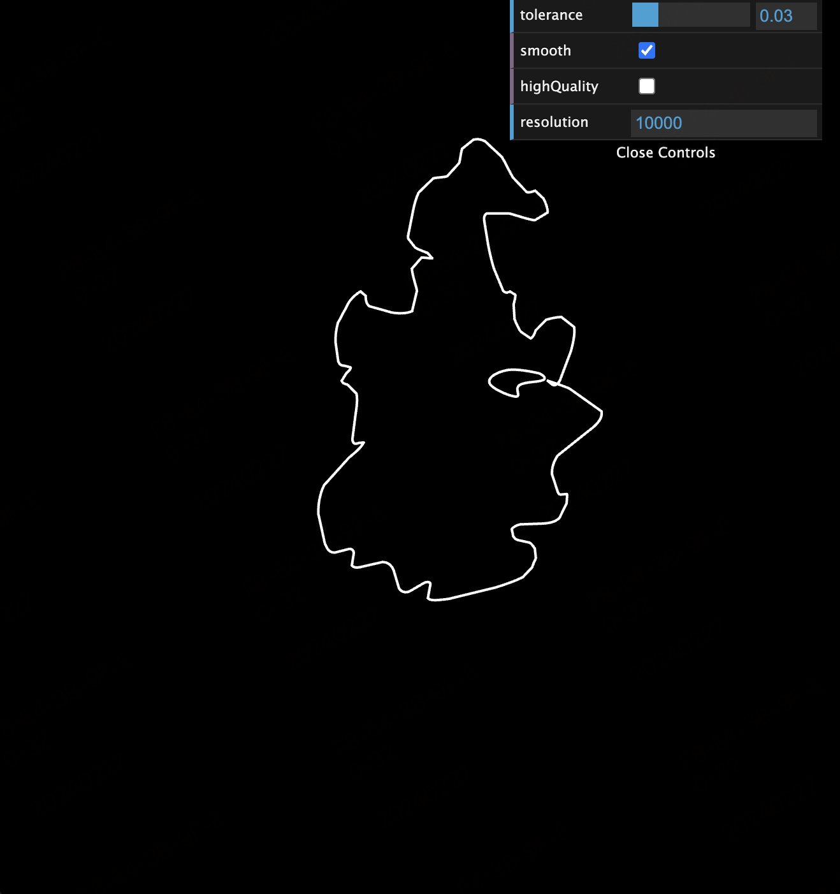

<div align="center" style="font-size: 16px">
    An simple example of smooth GeoJSON and Loop Subdivision
</div>


#### Steps

```
pnpm i
pnpm dev
```

#### Loop Subdivision

```javascript
// ...
const geo = new THREE.BoxGeometry(10, 10, 10)
const subdividedGeo = loopSubdivide(geo.toNonIndexed(), params)
subdividedBox.geometry = subdividedGeo
// ...
```

- before

</img>


- after

</img>
</img>


#### Simplify GeoJSON

```javascript
// ...
const group = new THREE.Group()
const simplified = simplifyGeo(geoJson)

simplified.features.forEach(feature => {
    const geometry = feature.geometry as Polygon
    const projection = d3
        .geoMercator()
        .center(feature.properties?.center as [number, number] ?? [0, 0])
        .translate([0, 0])
    geometry.coordinates.forEach((line) => {
        const positions: number[] = []
        line.forEach(position => {
            const proj = projection(position as [number, number]) || [0, 0]
            const [x, y] = proj
            positions.push(x, -y, 0)
        })
        const geo = new LineGeometry()
        geo.setPositions(positions)
        const mesh = new Line2(geo, mat)
        mesh.computeLineDistances()
        group.add(mesh)
    })
})

scene.add(group)
// ...
```

- before

</img>

- after

</img>

